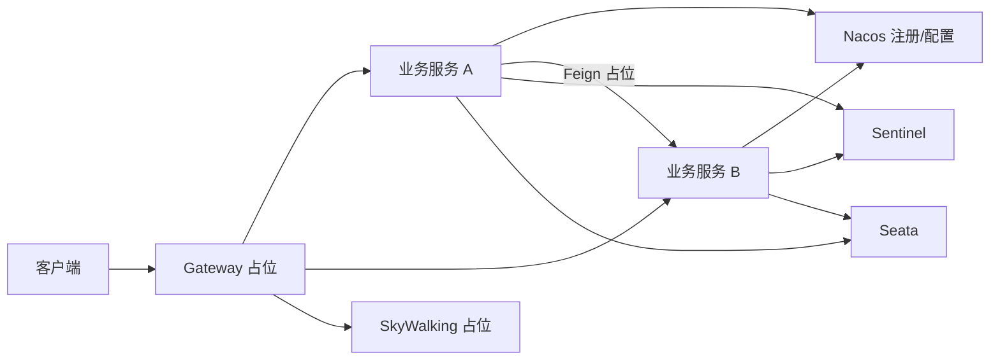

> **微服务 · SCA · 第 1/2 篇**  
> 上一篇：[《Spring Boot 自动配置底层源码解析》](/微服务/springboot/boot-03-autoconfigure)  
> 下一篇：[《Spring Cloud Alibaba 实战总结与组件地图》](/微服务/springcloud/sca-02-practice-summary)

---

## 开头：从单体到微服务，解决的是什么问题？

Martin Fowler 将**微服务架构**定义为：把原本独立的单体应用拆成多个小型服务，各自独立部署与扩展，服务间通过轻量级机制（通常是 HTTP/REST）通信，且可按业务选用不同语言与存储技术。Java 生态里，Spring Cloud 及其衍生版 **Spring Cloud Alibaba（SCA）** 是最常用的落地栈之一。本文建立概念框架，并给出本专栏后续组件的学习地图。

---

## 一、微服务架构是什么

### 1.1 历史脉络

- **2005–2009**：Fred George 在演讲中描述将百万行 J2EE 拆成多个 5000 行级小服务的实践，可视为早期微服务思想。  
- **2014 起**：Martin Fowler、Adrian Cockcroft 等人系统阐述定义与实践，微服务进入主流。  
- **国内**：.dubbo、HSF 等「分布式服务 / 服务化」与微服务思路相近；随着 Spring Cloud 生态成熟，业界普遍以「微服务」统称这种拆分模式。

### 1.2 核心特征

| 特征 | 说明 |
|------|------|
| 服务拆分 | 按业务能力边界拆成可独立部署的小服务 |
| 独立技术栈 | 各服务可选不同语言、框架、数据库 |
| 轻量通信 | REST、gRPC、消息等，替代进程内方法调用 |
| 独立伸缩 | 对热点服务单独扩容，资源利用更精细 |

参考：[Microservices - Martin Fowler](https://martinfowler.com/articles/microservices.html)

---

## 二、为什么要走向微服务

> 好的架构不是设计出来的，而是**演进**出来的。

典型演进路径（概念层面）：单机 → 读写分离与缓存 → 负载均衡 → 分库分表 → 按业务垂直拆分 → 公共能力沉淀为**独立微服务**。每一步都是为了应对**业务规模、团队规模或技术复杂度**的增长，而非为了微服务而微服务。

### 2.1 三大演进动因

| 动因 | 表现 |
|------|------|
| **业务规模** | 单体 + 常规优化（缓存、集群、读写分离等）仍扛不住，需要按域拆分 |
| **敏捷与协作** | 成百上千人共用一个代码库，分支冲突、沟通成本、发布耦合严重 |
| **技术储备** | 前端/后端/测试/运维/DBA/架构等角色齐备，具备服务化治理基础 |

此外，Spring Cloud、SCA、Nacos、Sentinel、Seata 等**开源与商业组件成熟**，使微服务从理论走向可落地工程。

### 2.2 与「分布式服务 / 服务化」的关系

微服务火之前，业界常用「分布式服务」「服务化」描述大系统拆分 + RPC（Dubbo、gRPC、HSF 等）。微服务在**边界划分、独立部署、治理组件**上更强调工程化与生态配套，思想一脉相承。

### 2.3 并非唯一方向

Service Mesh、DDD、云原生 Serverless 等是并行演进路线。**适合自身业务与团队能力的架构才是最好的**——小团队、低并发场景强行微服务，往往是「大炮轰蚊子」。

---

## 三、优缺点与适用场景

### 3.1 优点

- **开发与维护**：单服务职责清晰、代码量可控  
- **快速迭代**：独立开发、独立部署，减少全局回归  
- **灵活伸缩**：按服务热点分配资源  
- **技术选型**：团队可为不同服务选最合适栈  
- **错误隔离**：局部故障可通过熔断、降级限制爆炸半径  

### 3.2 缺点

- **落地复杂**：选型、拆分边界、组件搭建、运维体系工作量大  
- **调用链变长**：依赖关系与网络延迟增加，排查难度上升  
- **数据一致性**：跨服务事务需 Seata、消息最终一致性等方案  
- **学习成本高**：需同时掌握多个中间件与治理概念  

### 3.3 何时可以考虑微服务

需**同时满足**大致以下条件再评估：

1. 常规优化手段已用足，拆分能带来明确收益  
2. 技术评估结论正向（团队能驾驭复杂度）  
3. **人员与技能储备足够**（不是一两个人硬扛全栈治理）

否则优先做针对性优化即可。

---

## 四、Spring Cloud Alibaba 与示例架构

SCA 在 Spring Cloud 基础上集成阿里巴巴中间件，典型组件包括 **Nacos**（注册/配置）、**Sentinel**（流控熔断）、**Seata**（分布式事务）、**OpenFeign**（声明式调用）、**Gateway**（网关）等。

课程示例电商项目采用微服务分层：网关 → 业务服务 → 注册配置中心 → 流控与事务组件。整体拓扑可参考下图：

示例仓库：[vip_springcloud_alibaba_2024](https://gitee.com/dongchenglin/vip_springcloud_alibaba_2024)

---

## 五、本专栏 SCA 组件学习地图

下表依据课程大纲整理。**「本专栏」** 列标明当前仓库是否已有对应文章；标注 **占位** 的组件见 [补齐清单](/微服务/roadmap/ms-12-roadmap-placeholders)。

| 组件 | 职责 | 本专栏 | 备注 |
|------|------|--------|------|
| **Nacos 注册中心** | 服务发现与健康检查 | [Nacos 核心架构](/微服务/nacos/nacos-01-architecture) | 注册实战见课程 ProcessOn 脑图 |
| **Nacos 配置中心** | 动态配置、灰度发布 | [配置中心源码](/微服务/nacos/nacos-03-config-center) | |
| **LoadBalancer** | 客户端负载均衡（替代 Ribbon） | **占位** | 见 [补齐清单](/微服务/roadmap/ms-12-roadmap-placeholders) |
| **OpenFeign** | 声明式 HTTP 服务调用 | **占位** | 同上 |
| **Sentinel** | 限流、熔断、降级 | [Sentinel 架构源码](/微服务/sentinel/sentinel-01-architecture) | |
| **Seata** | 分布式事务 | [Seata 内核源码](/微服务/seata/seata-kernel-01-source) | 用法见 [分布式 · Seata 专栏](/分布式/seata/seata-01-distributed-tx-overview) |
| **Spring Cloud Gateway** | API 网关、路由与过滤器 | **占位** | 同上 |
| **SkyWalking** | 链路追踪与 APM | **占位** | 同上 |
| **Sa-Token** | 微服务鉴权与会话 | **占位** | 同上 |

**建议学习顺序（与本仓库文章 order 对齐）**

1. [Spring Boot 三篇](/微服务/springboot/boot-01-handwritten-core) — 理解 Boot 启动与自动配置  
2. 本文 + [实战总结](/微服务/springcloud/sca-02-practice-summary) — SCA 全景  
3. [Nacos](/微服务/nacos/nacos-01-architecture) → [Sentinel](/微服务/sentinel/sentinel-01-architecture) → [Seata 内核](/微服务/seata/seata-kernel-01-source)  
4. [Spring 扩展点](/微服务/spring-ext/spring-ext-01-extension-points) — 理解各组件如何挂接 Spring  
5. 占位组件待专栏补齐后跟进 Gateway / Feign / LoadBalancer 等  

---

## 小结

微服务是**业务与组织规模驱动下的架构演进结果**，SCA 提供了一站式治理组件。本专栏在 Boot 原理之后，按「概述 → 核心中间件源码 → 扩展点 → 占位补齐」推进；下一篇对 SCA 实战做结构化总结与导航。
