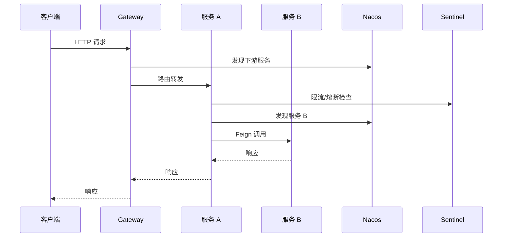

> **微服务 · SCA · 第 2/2 篇**  
> 上一篇：[《微服务架构概述与 Spring Cloud Alibaba》](/微服务/springcloud/sca-01-microservice-overview)  
> 下一篇：[《Nacos 2.x 核心架构源码剖析》](/微服务/nacos/nacos-01-architecture)

---

## 开头：学完 SCA 实战，该带走什么？

Spring Cloud Alibaba 实战课程覆盖注册配置、调用链、流控、事务、网关、链路与安全等模块。本文把**学习价值、组件协作关系、与本专栏文章的对应关系**整理成一张可执行的导航图，方便从「会用」过渡到「读源码、做架构」。

---

## 一、为什么要系统学微服务 / SCA

| 维度 | 收获 |
|------|------|
| **架构能力** | 理解拆分边界、服务治理、容错与一致性——高阶后端与架构师的公共语言 |
| **技术广度** | 注册中心、配置中心、RPC、网关、限流、分布式事务、可观测性一次打通 |
| **职业竞争力** | 中高级 Java 岗位普遍要求 Spring Cloud / SCA 经验，面试高频 |

云原生、容器化、CI/CD、DevOps 与微服务相互交织；把 SCA 作为**持续学习曲线上的枢纽**，再向 K8s、Service Mesh 延伸会更顺畅。

---

## 二、SCA 典型请求链路（概念）

一次前端请求在完整 SCA 栈中大致经历：

各组件职责：

- **Gateway**：统一入口、路由、鉴权、跨域（本专栏 [占位](/微服务/roadmap/ms-12-roadmap-placeholders)）  
- **Nacos**：服务注册发现 + 动态配置  
- **OpenFeign + LoadBalancer**：声明式调用与客户端负载均衡（[占位](/微服务/roadmap/ms-12-roadmap-placeholders)）  
- **Sentinel**：入口/资源级限流、熔断、降级  
- **Seata**：跨服务写操作的事务协调  
- **SkyWalking**：全链路追踪（[占位](/微服务/roadmap/ms-12-roadmap-placeholders)）  
- **Sa-Token**：认证授权（[占位](/微服务/roadmap/ms-12-roadmap-placeholders)）  

---

## 三、本专栏已覆盖 vs 待补齐

### 3.1 已有深度文章（源码向）

| 主题 | 文章 | 侧重点 |
|------|------|--------|
| Spring Boot 原理 | [01 手写核心](/微服务/springboot/boot-01-handwritten-core) · [02 启动源码](/微服务/springboot/boot-02-startup-source) · [03 自动配置](/微服务/springboot/boot-03-autoconfigure) | 启动与自动配置机制 |
| 微服务概述 | [01 概述](/微服务/springcloud/sca-01-microservice-overview) · 本文 | 架构与路线 |
| Nacos | [01 核心架构](/微服务/nacos/nacos-01-architecture) · [02 gRPC](/微服务/nacos/nacos-02-grpc) · [03 配置中心源码](/微服务/nacos/nacos-03-config-center) | 2.x 架构与配置推送 |
| Sentinel | [01 架构源码](/微服务/sentinel/sentinel-01-architecture) | Slot 链与规则管理 |
| Seata | [01 内核源码](/微服务/seata/seata-kernel-01-source) | 内核深化；用法见 [分布式专栏](/分布式/seata/seata-01-distributed-tx-overview) |
| Spring 扩展 | [01 扩展点](/微服务/spring-ext/spring-ext-01-extension-points) | 微服务组件如何接入 Spring |

### 3.2 占位模块（课程有、专栏待写）

以下在 [微服务专栏补齐清单](/微服务/roadmap/ms-12-roadmap-placeholders) 中跟踪：

| 模块 | 典型内容 |
|------|----------|
| **Spring Cloud Gateway** | 路由断言、过滤器链、与 Nacos 动态路由 |
| **OpenFeign** | 声明式客户端、契约、与 LoadBalancer 集成 |
| **LoadBalancer** | 替代 Ribbon 的负载均衡策略与自定义 |
| **SkyWalking** | Agent 探针、TraceId 传递、与 Gateway/Feign 集成 |
| **Sa-Token** | 微服务鉴权、SSO、与 Gateway 鉴权过滤器 |
| **Spring Boot 3 迁移** | 语雀/Boot3 生态差异（占位） |

---

## 四、按场景查阅

### 4.1 服务发现与配置

- **注册中心原理**：[/微服务/nacos/nacos-01-architecture](/微服务/nacos/nacos-01-architecture)  
- **2.x gRPC 通信**：[/微服务/nacos/nacos-02-grpc](/微服务/nacos/nacos-02-grpc)  
- **配置推送与长轮询**：[/微服务/nacos/nacos-03-config-center](/微服务/nacos/nacos-03-config-center)  

### 4.2 稳定性

- **限流熔断源码**：[/微服务/sentinel/sentinel-01-architecture](/微服务/sentinel/sentinel-01-architecture)  
- **降级策略**：结合 Sentinel 规则与 Gateway 占位篇（待补）  

### 4.3 分布式事务

- **AT/TCC 用法与场景**：[/分布式/seata/seata-01-distributed-tx-overview](/分布式/seata/seata-01-distributed-tx-overview)  
- **Seata 内核与 RM/TM 交互**：[/微服务/seata/seata-kernel-01-source](/微服务/seata/seata-kernel-01-source)  

### 4.4 框架底层

- **Boot 如何加载自动配置**：[/微服务/springboot/boot-03-autoconfigure](/微服务/springboot/boot-03-autoconfigure)  
- **各组件用的 Spring 扩展点**：[/微服务/spring-ext/spring-ext-01-extension-points](/微服务/spring-ext/spring-ext-01-extension-points)  

---

## 五、实战项目与自测建议

**参考仓库**：[vip_springcloud_alibaba_2024](https://gitee.com/dongchenglin/vip_springcloud_alibaba_2024)

**自测清单**

1. 能否画出「请求进 Gateway → 调下游 → 写库」的组件参与图？  
2. Nacos 注册与配置推送分别走什么协议/机制？（见 Nacos 三篇）  
3. Sentinel 规则存在哪、如何生效？（见 Sentinel 篇）  
4. 跨服务转账类场景，Seata AT 与 TCC 如何选型？（见分布式专栏）  
5. Boot 的 `@ConditionalOnClass` 与 Starter 如何配合？（见 Boot 03）  

**面试向**：结合项目说明「拆分了哪些服务、用什么做注册/限流/事务、线上如何排障」——比背诵 API 更有说服力。

---

## 六、与 Boot 专栏的衔接

SCA 各组件均以 **Spring Boot 应用** 为运行载体：

- 自动配置导入 Nacos/Sentinel/Seata Starter  
- `ApplicationContextInitializer`、`EnvironmentPostProcessor` 等扩展点加载远程配置  
- Web 容器在 Boot refresh 阶段启动（见 [启动过程源码](/微服务/springboot/boot-02-startup-source)）  

建议顺序：**Boot 三篇 → SCA 两篇（本文）→ Nacos → Sentinel → Seata → Spring 扩展点 → 占位补齐**。

---

## 小结

SCA 实战的价值在于建立**完整的微服务治理视图**。本专栏已覆盖 Boot 原理与 Nacos/Sentinel/Seata 内核；Gateway、Feign、LoadBalancer、SkyWalking、Sa-Token 等见 [补齐清单](/微服务/roadmap/ms-12-roadmap-placeholders)。下一篇进入 [Nacos 2.x 核心架构源码](/微服务/nacos/nacos-01-architecture)。
