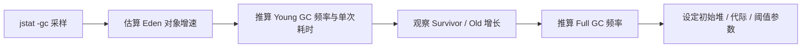
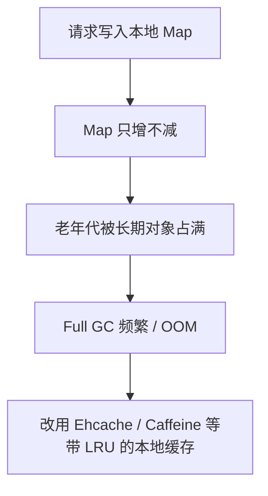

> **JVM 系列 · 第 9/12 篇**  
> 上一篇：[08 G1 与 ZGC](/性能调优/jvm/jvm-08-g1-zgc) · 下一篇：[10 常量池与调优补充](/性能调优/jvm/jvm-10-constant-pool)

---

## 场景：线上卡顿，先从哪下手？

GC 算法选好了，参数也配了，生产环境一旦 CPU 飙高、接口超时、频繁 Full GC，你仍需要**可观测性**：看清堆里有什么对象、哪条线程在占 CPU、Young/Full GC 的节奏是否合理。JDK 自带的 `jps`、`jmap`、`jstack`、`jstat`、`jinfo`，再配合 VisualVM / MAT，是 Java 工程师的「听诊器」。

本文按「工具能力 → 指标解读 → 完整案例」组织，建议事先启动一个 Web 应用，用 `jps` 拿到 PID 后，在本地或测试环境逐项练习。

---

## 一、jmap：看堆、导 dump

### 1.1 堆中对象统计

```bash
jmap -histo <pid> > log.txt
```

输出字段含义：

| 列 | 含义 |
|----|------|
| num | 序号 |
| instances | 实例数量 |
| bytes | 占用空间（字节） |
| class name | 类名；`[C` 为 char[]，`[I` 为 int[]，`[[I` 为 int[][] |


### 1.2 堆内存 dump

手动导出：

```bash
jmap -dump:format=b,file=eureka.hprof <pid>
```

也可在 OOM 时自动 dump（堆很大时可能导不出来）：

```bash
-XX:+HeapDumpOnOutOfMemoryError
-XX:HeapDumpPath=./
```

示例 OOM 程序：

```java
public class OOMTest {
    public static List<Object> list = new ArrayList<>();

    // -Xms10M -Xmx10M -XX:+PrintGCDetails
    // -XX:+HeapDumpOnOutOfMemoryError -XX:HeapDumpPath=D:\jvm.dump
    public static void main(String[] args) {
        List<Object> list = new ArrayList<>();
        int i = 0, j = 0;
        while (true) {
            list.add(new User(i++, UUID.randomUUID().toString()));
            new User(j--, UUID.randomUUID().toString());
        }
    }
}
```


用 **VisualVM** 或 **Eclipse MAT** 打开 `.hprof`，按「占用内存最大的类 / GC Root 引用链」定位泄漏源。

---

## 二、jstack：死锁与 CPU 热点

### 2.1 查找死锁

```bash
jstack <pid>
```

经典死锁示例：线程 1 持有 lock1 等 lock2，线程 2 持有 lock2 等 lock1。输出中关注：

```
"Thread-1" #12 prio=5 os_prio=0 tid=0x... nid=0x2d64 waiting for monitor entry
   java.lang.Thread.State: BLOCKED (on object monitor)
```

| 字段 | 含义 |
|------|------|
| 线程名 | 如 `Thread-1` |
| prio | 优先级 |
| tid | JVM 线程 ID |
| nid | 本地线程 ID（十六进制） |
| State | BLOCKED / WAITING / RUNNABLE 等 |


VisualVM 的「线程」面板也可自动检测死锁。

### 2.2 找出占用 CPU 最高的线程

```java
public class Math {
    public int compute() {
        int a = 1, b = 2;
        return (a + b) * 10;
    }
    public static void main(String[] args) {
        Math math = new Math();
        while (true) { math.compute(); }
    }
}
```

排查步骤：

```text
1. top -p <pid>          # 看 Java 进程
2. 按 H                   # 按线程维度看 CPU
3. 记下 CPU 最高线程的 tid，如 19664
4. printf "%x\n" 19664    # 转十六进制 → 0x4cd0
5. jstack <pid> | grep -A 10 4cd0
```


从栈顶方法反查业务代码，往往就是热点循环或无效计算。

### 2.3 远程 VisualVM（JMX）

普通 JAR：

```bash
java -Dcom.sun.management.jmxremote.port=8888 \
     -Djava.rmi.server.hostname=192.168.50.60 \
     -Dcom.sun.management.jmxremote.ssl=false \
     -Dcom.sun.management.jmxremote.authenticate=false \
     -jar app.jar
```

Tomcat 在 `catalina.sh` 的 `JAVA_OPTS` 末尾追加同样参数即可。


---

## 三、jinfo：查看运行中 JVM 参数

```bash
jinfo -flags <pid>      # 查看 JVM 参数
jinfo -sysprops <pid>   # 查看 Java 系统属性
```

适合核对「启动脚本写的参数」与「进程实际生效的参数」是否一致。

---

## 四、jstat：GC 与堆分区实时监控

格式：

```bash
jstat [-option] <vmid> [interval_ms] [count]
```

### 4.1 `jstat -gc`（最常用）

```bash
jstat -gc <pid> 1000 10   # 每秒采样，共 10 次
```


核心列（单位多为 KB，时间为秒）：

| 列 | 含义 |
|----|------|
| S0C / S1C | Survivor 0/1 容量 |
| S0U / S1U | Survivor 0/1 已用 |
| EC / EU | Eden 容量 / 已用 |
| OC / OU | Old 容量 / 已用 |
| MC / MU | Metaspace 容量 / 已用 |
| YGC / YGCT | Young GC 次数 / 总耗时 |
| FGC / FGCT | Full GC 次数 / 总耗时 |
| GCT | GC 总耗时 |

其他选项：`-gcutil`（各分区使用率百分比）、`-gccapacity`、分代统计等，需要时 `jstat -options` 查看。

### 4.2 用 jstat 做 JVM 运行预估



**年轻代对象增长速率**：`jstat -gc pid 1000 10`，观察 `EU` 变化；负载高/低峰分别采样。

**Young GC 频率与耗时**：Eden 大小 ÷ 对象增速 ≈ 触发间隔；`YGCT / YGC` ≈ 平均单次耗时。

**每次 Young GC 存活与晋升**：`jstat -gc pid 300000 10`（5 分钟一次），对比 GC 前后 Eden、Survivor、Old 的变化。

**Full GC**：老年代增速 + `FGCT / FGC`。

**优化目标（口诀）**：

- Young GC 后存活对象尽量小于 Survivor 的 50%，留在年轻代；
- 尽量少让对象进老年代；
- 降低 Full GC 频率，避免 STW 拖垮延迟。

---

## 五、实战：频繁 Full GC 导致卡顿

### 5.1 现象

| 项 | 值 |
|----|-----|
| 机器 | 2 核 4G |
| 堆 | 2G（-Xms1536M -Xmx1536M -Xmn512M） |
| 运行 | 7 天 |
| Full GC | 500+ 次，200+ 秒 |
| Young GC | 1 万+ 次，500+ 秒 |

粗算：每天约 70 次 Full GC（每小时 ~3 次，单次 ~400ms）；Young GC 每分钟 ~1 次，单次 ~50ms。

原参数（CMS 时代典型配置）：

```bash
-Xms1536M -Xmx1536M -Xmn512M -Xss256K -XX:SurvivorRatio=6
-XX:MetaspaceSize=256M -XX:MaxMetaspaceSize=256M
-XX:+UseParNewGC -XX:+UseConcMarkSweepGC
-XX:CMSInitiatingOccupancyFraction=75 -XX:+UseCMSInitiatingOccupancyOnly
```

结合对象晋升规则，怀疑 **动态年龄判定** 导致 Survivor 装不下，对象批量进老年代 → Full GC 频繁。


### 5.2 先调年轻代

```bash
-Xmn1024M
-XX:CMSInitiatingOccupancyFraction=92
```


若 Full GC 仍比 Minor GC 还多，继续排查：

1. **Metaspace 不足** → 多余 Full GC  
2. **显式 `System.gc()`** → 加 `-XX:+DisableExplicitGC`  
3. **老年代担保机制**  
4. **业务产生大量朝生夕死 + 晋升对象**

`jmap -histo` 发现大量 `User` 对象：


配合 `jstack` / VisualVM 找 CPU 高的栈，定位到：

```java
@RestController
public class IndexController {
    @RequestMapping("/user/process")
    public String processUserData() {
        ArrayList<User> users = queryUsers();  // 一次 new 5000 个 User
        for (User user : users) {
            System.out.println("user:" + user);
        }
        return "end";
    }
    private ArrayList<User> queryUsers() {
        ArrayList<User> users = new ArrayList<>();
        for (int i = 0; i < 5000; i++) {
            users.add(new User(i, "zhuge"));
        }
        return users;
    }
}
```

**结论**：JVM 参数只是缓解；必须改业务——分页、流式处理、避免单次分配数百 MB 短生命周期对象。

---

## 六、实战：JVM 级缓存导致的内存泄漏

多级缓存（Redis + 本地 HashMap）若**只放不淘汰**，Map 会长期占用老年代，Full GC 越来越频繁，最终 OOM。



生产环境优先用 **Caffeine、Ehcache** 等带容量与淘汰策略的框架，而不是裸 `HashMap`。

---

## 七、工具选用速查

| 问题 | 首选工具 |
|------|----------|
| 哪个 Java 进程 | `jps -l` |
| 堆里什么对象最多 | `jmap -histo`、MAT |
| OOM / 泄漏根因 | heap dump + MAT 引用链 |
| 死锁 / 线程阻塞 | `jstack`、VisualVM |
| CPU 100% | top -H + jstack |
| GC 频率、晋升 | `jstat -gc` |
| 参数是否生效 | `jinfo -flags` |
| 线上动态诊断 | Arthas（见下一篇） |

---

## 小结

- **jmap** 看对象分布、导 dump；**jstack** 查死锁和 CPU 线程；**jstat** 量化 GC 节奏；**jinfo** 核对参数。  
- 调优顺序：先用 jstat 建立「对象增速 → Young/Full GC」模型，再 dump + 栈定位代码，最后改参数与业务。  
- Full GC 频繁往往是参数与代码共同作用；只调 `-Xmn` 不能替代修复一次分配 5000 个对象这类问题。

下一篇补充 **Arthas、GC 日志、常量池** 等调优延伸内容。
