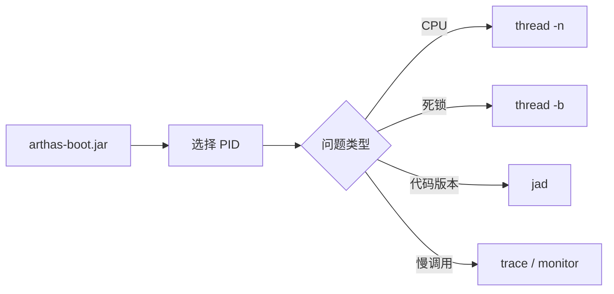
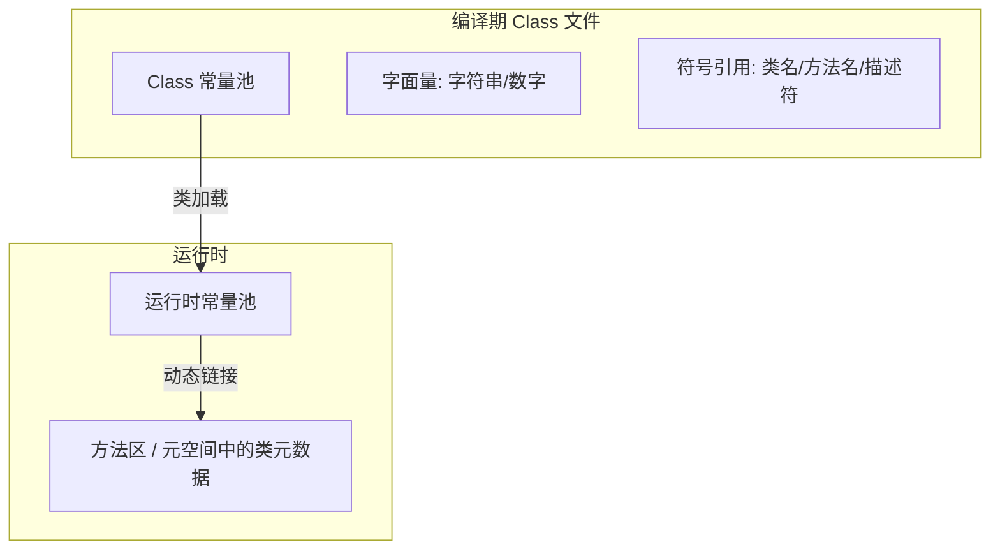

> **JVM 系列 · 第 10/12 篇**  
> 上一篇：[09 调优工具与实战](/性能调优/jvm/jvm-09-tuning-tools) · 下一篇：[11 JDK17 新特性](/性能调优/jvm/jvm-11-jdk17-features)

---

## 场景：线上不能重启，也不能加日志发版

上一篇的 `jmap`/`jstack` 适合「能登录机器、能拿 PID」的环境；更常见的是：**不能 debug、不能随意重启**，却要知道 CPU 为何升高、代码是否生效、类从哪个 jar 加载。Alibaba **Arthas** 用命令行交互完成这些诊断；同时 **GC 日志** 与 **常量池** 机制，也是调优与面试的高频考点。本文把三块内容串在一起。

---

## 一、Arthas：线上 Java 诊断

[Arthas](https://alibaba.github.io/arthas) 是 Alibaba 2018 年开源的 Java 诊断工具，支持 JDK 6+，命令行交互，官方文档非常完整。

### 1.1 典型使用场景

| 场景 | Arthas 能做什么 |
|------|----------------|
| 系统整体健康 | `dashboard` 总览 |
| CPU 升高 | `thread -n 3` 找最忙线程 |
| 死锁 / 阻塞 | `thread -b` |
| 方法耗时 | `trace` / `monitor` |
| 类从哪加载 | `sc` / `classloader` |
| 代码是否上线 | `jad` 反编译对比 |
| 不能加日志发版 | 动态 watch / trace |

### 1.2 安装与 attach

```bash
wget https://alibaba.github.io/arthas/arthas-boot.jar
# 或 Gitee：wget https://arthas.gitee.io/arthas-boot.jar

java -jar arthas-boot.jar
# 选择目标 Java 进程序号进入
```

测试程序（模拟 CPU 高、死锁、集合增长）：

```java
public class Arthas {
    private static HashSet hashSet = new HashSet();

    public static void main(String[] args) {
        cpuHigh();
        deadThread();
        addHashSetThread();
    }

    public static void addHashSetThread() {
        new Thread(() -> {
            int count = 0;
            while (true) {
                try {
                    hashSet.add("count" + count++);
                    Thread.sleep(1000);
                } catch (InterruptedException e) {
                    e.printStackTrace();
                }
            }
        }).start();
    }

    public static void cpuHigh() {
        new Thread(() -> { while (true) { } }).start();
    }

    private static void deadThread() {
        Object resourceA = new Object();
        Object resourceB = new Object();
        new Thread(() -> {
            synchronized (resourceA) {
                try { Thread.sleep(1000); } catch (InterruptedException ignored) { }
                synchronized (resourceB) { }
            }
        }).start();
        new Thread(() -> {
            synchronized (resourceB) {
                try { Thread.sleep(1000); } catch (InterruptedException ignored) { }
                synchronized (resourceA) { }
            }
        }).start();
    }
}
```

### 1.3 常用命令

```bash
dashboard          # 线程、内存、GC、运行环境
thread             # 所有线程 CPU 时间
thread <id>        # 指定线程栈
thread -b          # 死锁检测
jad com.example.Foo   # 反编译，确认线上版本
ognl '@logger@...'    # 执行 OGNL 表达式
help               # 完整命令列表
```



更多命令见 [Arthas 官方命令文档](https://alibaba.github.io/arthas/commands.html)。

---

## 二、GC 日志：打印与分析

### 2.1 JDK 8 风格参数（仍常见）

在 JVM 参数中增加：

```bash
-Xloggc:./gc-%t.log
-XX:+PrintGCDetails
-XX:+PrintGCDateStamps
-XX:+PrintGCTimeStamps
-XX:+PrintGCCause
-XX:+UseGCLogFileRotation
-XX:NumberOfGCLogFiles=10
-XX:GCLogFileSize=100M
```

Tomcat 写在 `JAVA_OPTS` 里；Spring Boot 写在 `JAVA_TOOL_OPTIONS` 或启动脚本。

示例启动：

```bash
java -jar \
  -Xloggc:./gc-%t.log \
  -XX:+PrintGCDetails \
  -XX:+PrintGCDateStamps \
  -XX:+PrintGCTimeStamps \
  -XX:+PrintGCCause \
  -XX:+UseGCLogFileRotation \
  -XX:NumberOfGCLogFiles=10 \
  -XX:GCLogFileSize=100M \
  microservice-eureka-server.jar
```

### 2.2 如何读一行 Full GC 日志

```
2024-01-01T10:00:00.123+0800: 2.909: [Full GC (Metadata GC Threshold)
 6160K->0K(141824K), 112K->6056K(95744K), 6272K->6056K(237568K),
 20516K->20516K(1069056K), 0.0209707 secs]
```

| 片段 | 含义 |
|------|------|
| `2.909` | JVM 启动到本次 GC 的秒数 |
| `Full GC (Metadata GC Threshold)` | Full GC，原因是元空间阈值 |
| `6160K->0K(141824K)` | Young：GC 前 → GC 后（容量） |
| `112K->6056K(95744K)` | Old |
| `6272K->6056K(237568K)` | 整个堆 |
| `20516K->20516K(1069056K)` | Metaspace |
| `0.0209707 secs` | 本次 STW 耗时 |

若多次 Full GC 都因 **Metaspace** 触发，可调大：

```bash
-XX:MetaspaceSize=256M -XX:MaxMetaspaceSize=256M
```

### 2.3 CMS / G1 对比实验

`HeapTest` 持续 `new byte[102400]`：

```java
public class HeapTest {
    byte[] a = new byte[1024 * 100];
    public static void main(String[] args) throws InterruptedException {
        ArrayList<HeapTest> list = new ArrayList<>();
        while (true) {
            list.add(new HeapTest());
            Thread.sleep(10);
        }
    }
}
```

**CMS**（JDK 8 典型）：

```bash
-Xloggc:d:/gc-cms-%t.log -Xms50M -Xmx50M
-XX:MetaspaceSize=256M -XX:MaxMetaspaceSize=256M
-XX:+PrintGCDetails -XX:+PrintGCDateStamps -XX:+PrintGCTimeStamps
-XX:+PrintGCCause -XX:+UseGCLogFileRotation -XX:NumberOfGCLogFiles=10
-XX:GCLogFileSize=100M
-XX:+UseParNewGC -XX:+UseConcMarkSweepGC
```

**G1**：

```bash
# 同上，Collector 改为：
-XX:+UseG1GC
```

日志中的 GC 阶段应与前面 G1/CMS 章节对应。JDK 17 统一用 `-Xlog:gc*`（见第 12 篇）。

### 2.4 gceasy 可视化

日志行数上万时，可上传 [gceasy.io](https://gceasy.io) 做图表化分析与优化建议（部分高级功能需付费）。适合快速看 Young/Old 占用曲线、GC 停顿分布。

---

## 三、JVM 参数汇总查看

```bash
java -XX:+PrintFlagsInitial   # 所有选项默认值
java -XX:+PrintFlagsFinal     # 当前进程最终生效值
java -XX:+PrintCommandLineFlags -version  # 当前命令行上的 -XX 参数
```

排查「脚本写了但没生效」时，以 `PrintFlagsFinal` 为准。

---

## 四、Class 常量池与运行时常量池

### 4.1 Class 文件中的常量池

Class 文件除版本、字段、方法、接口外，还有 **常量池（constant_pool）**，存放编译期生成的 **字面量** 与 **符号引用**。



查看字节码：

```bash
javap -v Math.class
```

输出中 `#` 开头的即为常量池项。两大类：

**字面量**：字符串、数值等「右值」，如 `int a = 1` 里的 `1`。

**符号引用**（编译原理概念）：

- 类/接口全限定名，如 `Lcom/tuling/jvm/Math;`
- 字段名与描述符
- 方法名与描述符，如 `main`、`()V`

加载进内存后，符号引用通过 **动态链接** 转为 **直接引用**（方法在内存中的入口地址等）。

### 4.2 运行时常量池

Class 常量池是静态信息；类加载后进入方法区/元空间的 **运行时常量池**，符号引用在运行期才绑定到具体地址。

---

## 五、字符串常量池

### 5.1 设计思想

字符串创建成本高，JVM 维护 **字符串常量池（String Table）**：创建前先查池，有则复用引用，无则入池（具体规则随 JDK 版本变化）。

### 5.2 三种创建方式（JDK 7+）

**直接字面量**

```java
String s = "zhuge";  // 指向常量池中的引用
```

**new String**

```java
String s1 = new String("zhuge");  // 堆上新对象 + 池中可能有 "zhuge"
```

流程：有字面量 `"zhuge"` 则先确保池中有；再在堆上 new，返回堆引用。

**intern()**

```java
String s1 = new String("zhuge");
String s2 = s1.intern();
System.out.println(s1 == s2);  // false：s1 堆上，s2 池引用
```

`intern()` 为 native 方法：池中有 equal 相等的串则返回池引用；否则 JDK 7+ 将堆上对象引用写入池中（JDK 6 会在 PermGen 复制一份）。

### 5.3 字符串池位置演进

| JDK | 字符串常量池位置 |
|-----|------------------|
| 6 及以前 | PermGen（永久代）内 |
| 7 | 从 PermGen 挪到 **堆** |
| 8+ | 仍在 **堆**；运行时常量池在 **Metaspace** |

验证 OOM 类型：

```java
/**
 * -Xms10M -Xmx10M
 */
public class RuntimeConstantPoolOOM {
    public static void main(String[] args) {
        ArrayList<String> list = new ArrayList<>();
        for (int i = 0; i < 10_000_000; i++) {
            list.add(String.valueOf(i).intern());
        }
    }
}
```

- JDK 7+：`OutOfMemoryError: Java heap space`
- JDK 6：`OutOfMemoryError: PermGen space`

### 5.4 intern 与版本差异（面试高频）

```java
String s1 = new String("he") + new String("llo");
String s2 = s1.intern();
System.out.println(s1 == s2);
```

| JDK | 结果 | 说明 |
|-----|------|------|
| 6 | false | intern 在 PermGen 复制，s1 仍在堆 |
| 7+ | true | 池在堆，intern 直接记录堆上 s1 的引用 |

底层 StringTable 类似 HashTable，存的是 **字符串对象的引用**。

### 5.5 经典例题速查

**例 1：编译期常量折叠**

```java
String s0 = "zhuge", s1 = "zhuge", s2 = "zhu" + "ge";
// s0==s1==s2 → true
```

**例 2：new 与运行时拼接**

```java
String s0 = "zhuge";
String s1 = new String("zhuge");
String s2 = "zhu" + new String("ge");
// 全 false（s0 在池，s1/s2 在堆）
```

**例 3：`"a" + 1` 等**

```java
String a = "a1", b = "a" + 1;           // true，编译期优化
String a = "atrue", b = "a" + "true";   // true
String a = "a3.4", b = "a" + 3.4;       // true
```

**例 4：引用参与拼接**

```java
String bb = "b";
String b = "a" + bb;   // false，bb 运行时才知道
```

**例 5：final 局部变量**

```java
final String bb = "b";
String b = "a" + bb;   // true，bb 编译期当常量
```

**例 6：final 来自方法**

```java
final String bb = getBB();  // false
private static String getBB() { return "b"; }
```

**例 7：String 不可变与 `+`**

```java
String s = "a" + "b" + "c";  // 等价于 "abc" 一个字面量

String a = "a", b = "b", c = "c";
String s1 = a + b + c;     // 编译为 StringBuilder.append...toString()
```

**例 8：StringBuilder 与 intern**

```java
String str2 = new StringBuilder("计算机").append("技术").toString();
System.out.println(str2 == str2.intern());  // true，堆上有对象，池中没有则 intern 指向堆

String str1 = new StringBuilder("ja").append("va").toString();
System.out.println(str1 == str1.intern());  // false，"java" 关键字早已在池中

String s1 = new String("test");
System.out.println(s1 == s1.intern());      // false，"test" 在池，s1 在堆
```

---

## 六、八种包装类的对象池

`Byte`、`Short`、`Integer`、`Long`、`Character`、`Boolean` 实现了缓存；**Float/Double 没有**。

`Integer` 等在 **-128 ~ 127** 内使用 `IntegerCache`：

```java
Integer i1 = 127, i2 = 127;
System.out.println(i1 == i2);        // true

Integer i3 = 128, i4 = 128;
System.out.println(i3 == i4);        // false

Integer i5 = new Integer(127), i6 = new Integer(127);
System.out.println(i5 == i6);        // false

Boolean b1 = true, b2 = true;
System.out.println(b1 == b2);        // true

Double d1 = 1.0, d2 = 1.0;
System.out.println(d1 == d2);        // false
```

比较包装类请用 `equals()`，不要用 `==`（除非明确在缓存范围内且未 new）。

---

## 小结

| 主题 | 要点 |
|------|------|
| Arthas | 线上 attach、`dashboard`/`thread`/`jad`，补 JDK 工具不能动态诊断的短板 |
| GC 日志 | 看 Cause、各代前后大小、STW 时间；Metaspace 不足调 `-XX:MaxMetaspaceSize` |
| Class 常量池 | 编译期字面量 + 符号引用；加载后为运行时常量池 |
| 字符串池 | JDK 7+ 在堆；`intern` 行为与版本强相关 |
| 包装类池 | -128~127 缓存，比较用 `equals` |

下一篇进入 **JDK 17 LTS 新特性**：语法增强、模块化、GC 与 GraalVM 概览。
