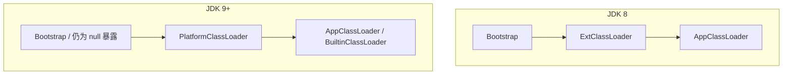

> **JVM 系列 · 第 11/12 篇**  
> 上一篇：[10 常量池与调优补充](/性能调优/jvm/jvm-10-constant-pool) · 下一篇：[12 JDK17 GC 调优](/性能调优/jvm/jvm-12-jdk17-gc)

---

## 场景：Spring Boot 3 要求 Java 17，你还在 Java 8？

「你发任你发，我用 Java 8」曾是业界常态，但 **Spring Boot 3 / Spring 6** 已明确抛弃 JDK 8，**JDK 17** 成为现代 Java 应用的基线 LTS。它不仅是 JDK 8 之后重要的长期支持版，在生态成熟度上也优于 JDK 11。跳过 11 直接上 17，对 JDK 8 时代的开发者是性价比较高的升级路径。

本文从 **语法 → 类封装 → 模块化 → GC → GraalVM** 梳理 JDK 17 值得掌握的变化（不追求罗列每一个 JEP）。

---

## 一、语法层面新特性

### 1.1 文本块（Text Blocks）

多行字符串用三个双引号 `"""` 包围，减少 `\n` 转义，可与 `String.format` 配合：

```java
String query =
    """
    SELECT `EMP_ID`, `LAST_NAME` FROM `EMPLOYEE_TB` \s
    WHERE `CITY` = '%s' \
    ORDER BY `EMP_ID`, `LAST_NAME`;
    """;
System.out.println(String.format(query, "合肥"));
```

新增转义：

| 转义 | 含义 |
|------|------|
| `\` 行尾 | 两行拼成一行 |
| `\s` | 单个空白字符 |


### 1.2 Switch 表达式增强

Switch 既可作语句，也可作表达式；支持 `->` 与 **`yield`** 返回值：

```java
// 多 case 合并
switch (name) {
    case "李白", "杜甫", "白居易" -> System.out.println("唐代诗人");
    case "苏轼", "辛弃疾" -> System.out.println("宋代诗人");
    default -> System.out.println("其他朝代诗人");
}

// 作为表达式
int tmp = switch (name) {
    case "李白", "杜甫", "白居易" -> 1;
    case "苏轼", "辛弃疾" -> 2;
    default -> {
        System.out.println("其他朝代诗人");
        yield 3;
    }
};
```

### 1.3 instanceof 模式匹配

匹配成功则自动绑定变量，无需再强转：

```java
if (o instanceof Integer i && i > 0) {
    System.out.println(i.intValue());
} else if (o instanceof String s && s.startsWith("t")) {
    System.out.println(s.charAt(0));
}
```

### 1.4 var 局部变量类型推导

```java
var nums = new int[] {1, 2, 3, 4, 5};
var sum = Arrays.stream(nums).sum();
```

仅用于局部变量；团队规范需统一，避免滥用降低可读性。

---

## 二、模块化及类封装

### 2.1 record 记录类

JDK 14 引入，16 转正。描述 **不可变数据载体**，替代大量 BO/DTO：

```java
public record Point(int x, int y) { }

Point p = new Point(10, 20);
System.out.println(p.x() + "," + p.y());  // 访问器与字段同名，非 getX()
```

- 字段隐式 `private final`
- 自动生成 `equals` / `hashCode` / `toString`，且为 `final`
- 反射也无法修改字段值


### 2.2 隐藏类（Hidden Classes）

JDK 15+：不经过传统类加载器路径，由 **Lookup.defineHiddenClass** 从字节码直接定义，仅反射可见，不可被普通类直接引用：

```java
byte[] classInBytes = Base64.getDecoder().decode(CLASS_INFO_BASE64);
Class<?> proxy = MethodHandles.lookup()
    .defineHiddenClass(classInBytes, true, MethodHandles.Lookup.ClassOption.NESTMATE)
    .lookupClass();
```

用途：Lambda、动态代理、框架在运行时生成逻辑——减少 ASM 手写成本，缩短动态类生命周期。与 Kotlin/Scala 匿名函数、Spring ASM 增强一脉相承。

### 2.3 密封类（Sealed Classes）

JDK 15 预览，17 转正。限制 **谁可以继承/实现** 父类：

```java
public sealed abstract class Shape permits Circle, Rectangle, Square {
    public abstract int lines();
}

public final class Circle extends Shape {
    @Override public int lines() { return 0; }
}

public non-sealed class Square extends Shape {  // 可再被任意继承
    @Override public int lines() { return 4; }
}

public sealed class Rectangle extends Shape permits FilledRectangle {
    @Override public int lines() { return 3; }
}

public final class FilledRectangle extends Rectangle {
    @Override public int lines() { return 0; }
}
```

子类修饰符三选一：`final` / `sealed` / `non-sealed`。  
限制：父类与子类须在 **同一命名 module** 且 **直接继承**。

可类比：若类加载体系对 `SecureClassLoader` 子类做 sealed，可约束自定义加载器范围（JDK 本身未这样做）。

### 2.4 Module System（JDK 9+，17 已成熟）

#### 什么是模块化

Package 之上增加 **module**：一组相关包 + `module-info.java` 描述符。JDK 17 安装目录下是 **`.jmod`** 而非零散 rt.jar：

```bash
java --list-modules
```


定制最小 JRE：

```bash
jlink -p $JAVA_HOME/jmods --add-modules java.base --output basejre
```

#### 声明 module

`module-info.java`：

```java
module roy.demomodule {
    requires junit;
    requires java.sql;
    exports com.roy.language;
    // opens com.roy.internal;  // 允许反射
}
```

| 关键字 | 作用 |
|--------|------|
| `requires` | 编译+运行依赖；`requires static` 仅编译期 |
| `exports` | 对外 API（编译+运行，不可反射） |
| `opens` | 允许反射访问 |
| `provides ... with` | SPI 服务实现 |
| `uses` | 消费 SPI 接口 |

非模块化 jar 默认 **自动模块**，名一般为 jar 名去版本，如 `junit-4.13.2.jar` → `requires junit;`。

#### 模块化 SPI 示例

**提供方** `roy.demomodule2`：

```java
module roy.demomodule2 {
    exports com.roy.service;
    provides com.roy.service.HelloService with
        com.roy.service.impl.MorningHello,
        com.roy.service.impl.EveningHello;
}
```

**消费方** `roy.demomodule`：

```java
module roy.demomodule {
    requires roy.demomodule2;
    uses com.roy.service.HelloService;
}
```

```java
ServiceLoader<HelloService> services = ServiceLoader.load(HelloService.class);
for (HelloService s : services) {
    System.out.println(s.sayHello("loulan"));
}
```

运行：

```bash
java --module-path demoModule.jar:demoModule2.jar \
     -m roy.demomodule/com.roy.spi.ServiceDemo
```


#### 类加载机制调整（JDK 9+）



要点：

1. **ExtClassLoader → PlatformClassLoader**（扩展目录被模块取代）
2. **BuiltinClassLoader** 负责从模块加载类与资源
3. **双亲委派微调**：Platform/App 加载前先判断是否归属某 **系统模块**，优先委派给该模块加载器；自定义 ClassLoader 仍可按旧规则


---

## 三、GC 与运行时调整（概览）

| 变更 | 说明 |
|------|------|
| **ZGC 转正** | `-XX:+UseZGC`，JDK 17 上相关不稳定参数已很少 |
| **Shenandoah** | `-XX:+UseShenandoahGC` 可选 |
| **CMS 删除** | JDK 14 移除 CMS；Serial Old 随 CMS 退场 |
| **偏向锁** | JDK 15 默认废弃，可 `-XX:+UseBiasedLocking` 手动开 |
| **Socket API** | 底层重写，易维护 |
| **G1 默认** | JDK 9+ 服务端默认 G1（详见下一篇参数） |


---

## 四、GraalVM 简介

Graal 最初是 HotSpot C1 的下一代编译器（Java 实现），配合 **JVMCI** 可独立于 HotSpot，形成 **GraalVM**：支持 JIT、AOT（Native Image）、多语言 Truffle。

### 4.1 为什么关注

- 传统 HotSpot 面向 **长时间运行、充分预热**；微服务要 **快启动、低内存**，Graal **Native Image** 有优势  
- Oracle 希望用 Graal 逐步替代臃肿的 C1/C2 维护成本

### 4.2 安装与验证

官网：https://www.graalvm.org ，选择 JDK 17 对应版本：

```bash
java -version
# Java(TM) SE Runtime Environment Oracle GraalVM 17.0.x ...

gu list    # 组件管理，如 native-image
```

Hello World 对比 JIT 启动耗时差异不大；**Native Image** 编译后无 JVM 亦可运行：

```bash
javac Hello.java
native-image Hello
./hello    # 启动可达毫秒级（需安装 zlib 等本地依赖）
```


AOT 编译失败常见原因：缺少 `zlib-devel` 等链接库，按报错安装后重试。

GraalVM 的 **Truffle** 框架可在同一运行时托管 JS、Python 等语言——与「Java 没落论」相反，JVM 生态仍在向云原生与多语言方向演进。


---

## 小结

- **JDK 17** 是 Spring 生态与 LTS 策略下的务实升级目标。  
- **语法**：文本块、Switch 表达式、模式匹配、`var`。  
- **类型系统**：`record`、密封类、隐藏类支撑更安全的 API 与框架字节码生成。  
- **Module System** 改变 JDK 打包、依赖与类加载，升级前需评估 `module-info` 与自动模块。  
- **GC**：CMS 退场，G1 默认，ZGC/Shenandoah 可选；具体调参见下一篇。

下一篇：[基于 JDK17 的 GC 调优策略](/性能调优/jvm/jvm-12-jdk17-gc)——结合 RocketMQ 启动脚本讲「内存布局 → 选 GC → 打日志」三部曲。
