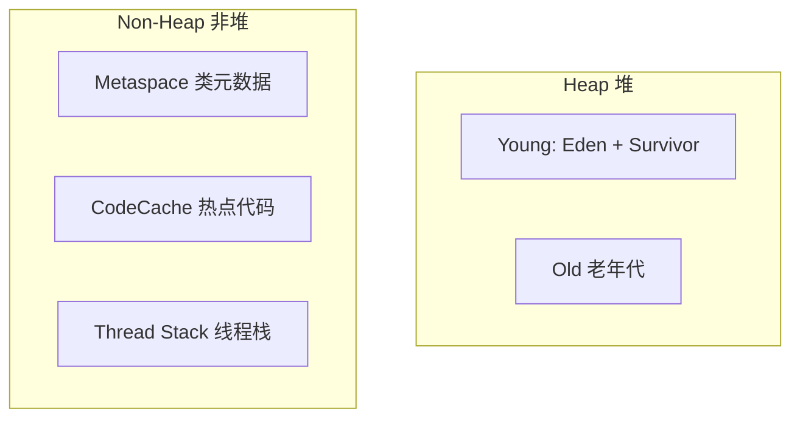

> **JVM 系列 · 第 12/12 篇（完结）**  
> 上一篇：[11 JDK17 新特性](/性能调优/jvm/jvm-11-jdk17-features)  
> 本专栏后续：[Tomcat 整体架构](/性能调优/tomcat/tomcat-01-architecture) · 数据库调优见 [MySQL 专栏](/数据库/)

---

## 场景：参数几百个，线上又不敢乱试

GC 决定 Java 程序很大一部分延迟与吞吐。JVM 可调参数极多，且 **没有唯一正确答案**——否则 JDK 早就写进默认值了。可行路径是：**跟成熟开源项目学思路**（如 RocketMQ NameServer/Broker 启动脚本），在测试环境反复验证，再小流量上线。

本文基于 **JDK 17**，按 RocketMQ 的经验归纳 **调内存布局 → 选 GC → 打 GC 日志** 三部曲，并补充 G1/ZGC 要点与远程调试技巧。

---

## 一、JVM 参数有哪几类？

| 类型 | 前缀 | 说明 | 查看方式 |
|------|------|------|----------|
| 标准参数 | `-` | 所有 HotSpot 支持 | `java -help` |
| 非标准参数 | `-X` | 特定版本，较稳定 | `java -X` |
| 不稳定参数 | `-XX` | 随版本变化，调优主战场 | 见下表 |

常用标准参数示例：

```bash
--list-modules              # 模块列表
--show-module-resolution    # 模块依赖
-verbose:class               # 类加载
-verbose:gc                  # GC 事件（老写法）
```

非标准示例：`-Xms`、`-Xmx`、`-Xint` / `-Xcomp` / `-Xmixed`、`-Xbatch`（禁用后台编译，全部前台编译完成）。

不稳定参数诊断：

```bash
java -XX:+PrintFlagsInitial      # 默认值
java -XX:+PrintFlagsFinal         # 最终生效值
java -XX:+PrintCommandLineFlags   # 当前命令行 -XX
```

**小测验**：JDK 17 默认垃圾收集器是？—— **G1**（`-XX:+UseG1GC`）。可在 IDEA 运行配置或 `java -XX:+PrintCommandLineFlags -version` 中核对实际启动命令。


Boolean 型 `-XX`：`+` 开启，`-` 关闭，例如 `-XX:+UseG1GC`、`-XX:-UseBiasedLocking`。

---

## 二、从 RocketMQ 学 GC 调优三部曲

RocketMQ **NameServer** 启动脚本根据 JDK 大版本分支选择 GC 参数，核心逻辑：

```bash
JAVA_MAJOR_VERSION=$(java -version 2>&1 | awk -F '"' '/version/ {print $2}' | awk -F '.' '{print $1}')
```

### 2.1 JDK 8 及以前（CMS 时代）

```bash
-server -Xms4g -Xmx4g -Xmn2g
-XX:MetaspaceSize=128m -XX:MaxMetaspaceSize=320m
-XX:+UseConcMarkSweepGC -XX:+UseCMSCompactAtFullCollection
-XX:CMSInitiatingOccupancyFraction=70 -XX:+CMSParallelRemarkEnabled
-XX:SoftRefLRUPolicyMSPerMB=0 -XX:+CMSClassUnloadingEnabled
-XX:SurvivorRatio=8 -XX:-UseParNewGC
-verbose:gc -Xloggc:${GC_LOG_DIR}/rmq_srv_gc_%p_%t.log
-XX:+PrintGCDetails -XX:+PrintGCDateStamps
-XX:+UseGCLogFileRotation -XX:NumberOfGCLogFiles=5 -XX:GCLogFileSize=30m
```

### 2.2 JDK 9+（含 JDK 17，G1）

```bash
-server -Xms4g -Xmx4g
-XX:MetaspaceSize=128m -XX:MaxMetaspaceSize=320m
-XX:+UseG1GC -XX:G1HeapRegionSize=16m -XX:G1ReservePercent=25
-XX:InitiatingHeapOccupancyPercent=30 -XX:SoftRefLRUPolicyMSPerMB=0
-Xlog:gc*:file=${GC_LOG_DIR}/rmq_srv_gc_%p_%t.log:time,tags:filecount=5,filesize=30M
```

注意：**JDK 9+ 脚本不再设 `-Xmn`**——与 G1 区域化模型一致。


NameServer 与 Broker 业务不同，但 **调参思路相同**；学的是方法论，不是复制粘贴。


---

## 三、基于 JDK17 优化内存布局

所有方法与 GC 都发生在 JVM 内存中。先用 Arthas `memory` 或 NMT 建立直觉：**Heap（堆）** 与 **Non-Heap（非堆）**。



### 3.1 堆内存

| 参数 | 含义 |
|------|------|
| `-Xms` | 初始堆；建议与 `-Xmx` 相同，减少运行期扩容 |
| `-Xmx` | 最大堆；等同 `-XX:MaxHeapSize` |
| `-XX:InitialHeapSize` | 若写在 `-Xms` 之后，以它为准 |
| `-XX:MinHeapFreeRatio` / `MinHeapSize` | GC 后堆低于阈值会扩容 |

单位：`k/K`、`m/M`、`g/G`；须为 1024 的整数倍且 > 1M。

内存紧张时可 `-Xms` < `-Xmx` 让 JVM 按需增长，但会增加扩容抖动。

### 3.2 非堆：Metaspace

JDK 8 起 **PermGen → Metaspace**，使用 **本地内存**，不再占堆上限，但耗尽仍会 OOM。

| 参数 | 含义 |
|------|------|
| `-XX:MetaspaceSize` | 超过阈值触发 GC（非精确上限） |
| `-XX:MaxMetaspaceSize` | 硬上限，建议设合理值防异常暴涨 |

类元数据在启动期加载为主，运行期增量通常不大；动态类加载多（Groovy、大量代理）需单独评估。

### 3.3 线程栈 `-Xss`

默认 Linux/macOS 约 **1MB**。递归深、栈帧大时可调 `-Xss512k` 等；过小 → `StackOverflowError`。等同 `-XX:ThreadStackSize=1024k`。

### 3.4 CodeCache（热点代码）

`-server` 模式下 C2 编译结果存于 CodeCache：

| 参数 | 说明 |
|------|------|
| `-XX:InitialCodeCacheSize` | 初始大小 |
| `-XX:ReservedCodeCacheSize` | 最大，默认约 240MB |
| `-XX:+SegmentedCodeCache` | JDK 17 **默认开启**，分段利用更灵活 |

需 `-XX:+TieredCompilation` 且 `ReservedCodeCacheSize >= 240M` 分段才充分生效。

### 3.5 AppCDS（应用程序类数据共享）

首次运行归档类数据，后续 JVM 复用，加快启动、省内存：

```bash
# 生成归档
java -Xshare:dump -XX:SharedArchiveFile=hello.jsa -version

# 使用归档
java -XX:SharedArchiveFile=hello.jsa -Xlog:class+load -version
# 日志可见：source: shared objects file
```

微服务多实例部署时可作为可选项。


---

## 四、基于 JDK17 定制 GC 参数

JDK 17 **已无 CMS**，重点 **G1（默认）** 与 **ZGC**。

### 4.1 使用 G1 时不要用的参数

忘记分代时代的：

- `-Xmn`
- `-XX:NewRatio`
- `-XX:SurvivorRatio`

G1 按 **Region** 组织堆，年轻代大小不固定。

### 4.2 G1 核心参数

| 参数 | 说明 | RocketMQ 示例 |
|------|------|---------------|
| `-XX:+UseG1GC` | 启用 G1（JDK17 默认） | 显式指定 |
| `-Xmx` | 堆大小 | 4g |
| `-XX:MaxGCPauseMillis` | 期望最大停顿，默认 200ms | 可按 SLA 调整 |
| `-XX:G1HeapRegionSize` | Region 大小，1~32MB，2 的幂；默认 ≈ 堆/2048 | **16m**（偏大，降 GC 频率、增单次停顿） |
| `-XX:G1ReservePercent` | 保留空闲比例防突变，默认 10% | **25%**（空间换时间） |
| `-XX:InitiatingHeapOccupancyPercent` | 老年代占比达阈值启动并发标记，默认 45 | **30**（更积极） |
| `-XX:G1UseAdaptiveIHOP` | 自适应 IHOP，默认 true | — |
| `-XX:G1AdaptiveIHOPNumInitialSamples` | 前 N 次 GC 用固定 IHOP，默认 3 | — |
| `-XX:SoftRefLRUPolicyMSPerMB` | 软引用 LRU 毫秒/MB 堆，默认 1000 | **0**（更快清理软引用） |

**引用级别速记**：强引用 > 软引用（内存不足才回收）> 弱引用 > 虚引用（用于 DirectBuffer 清理通知等）。

JDK 17 新增/常用 G1 参数：

| 参数 | 说明 |
|------|------|
| `-XX:ParallelGCThreads` | GC 并行线程数 |
| `-XX:G1HeapWastePercent` | 堆浪费比例低于此值不启动 GC 周期，默认 5% |
| `-XX:G1OldCSetRegionThresholdPercent` | Mixed GC 清理 Old 比例上限，默认 10% |
| `-XX:G1MixedGCCountTarget` | Mixed GC 次数上限，默认 8 |


### 4.3 ZGC 核心参数

ZGC JDK 11 引入，17 已可用于生产；参数少、自适应强：

| 参数 | 说明 |
|------|------|
| `-XX:+UseZGC` | 启用 ZGC，停顿毫秒级，堆 8MB~16TB |
| `-XX:ZAllocationSpikeTolerance` | 分配尖峰容忍，默认 2.0 |
| `-XX:ZCollectionInterval` | 两次 GC 最大间隔（秒），0=禁用 |
| `-XX:ZFragmentationLimit` | 堆碎片上限%，默认 25 |
| `-XX:+ZProactive` |  proactive GC，默认开 |
| `-XX:+ZUncommit` | 归还未用堆给 OS，默认开 |
| `-XX:ZUncommitDelay` | 未用多久可 uncommit，默认 300s |

**实践建议**：多数场景 **只设 `-Xmx`**，在内存占用与 GC 频率间找平衡；除非有明确 SLA 数据，否则少动 ZGC 细参。

---

## 五、GC 日志（JDK 17 统一 -Xlog）

JDK 8 日志参数分散；**JDK 9+ 统一为 `-Xlog`**。

RocketMQ JDK 9+ 配置：

```bash
-Xlog:gc*:file=${GC_LOG_DIR}/rmq_srv_gc_%p_%t.log:time,tags:filecount=5,filesize=30M
```

| 部分 | 含义 |
|------|------|
| `gc*` | 所有 GC 详细事件，≈ 旧 `-XX:+PrintGCDetails` |
| `file=...%p_%t.log` | 路径，含 pid、时间 |
| `time,tags` | 文件名后缀选项 |
| `filecount=5,filesize=30M` | 滚动 5 个文件，每个 30MB |

JDK 8 vs 17 对照：

| JDK 8 | JDK 17 |
|-------|--------|
| `-Xloggc:path` | `-Xlog:gc*:file=path` |
| `-XX:+PrintGCDetails` | `gc*` |
| `-XX:+PrintGCDateStamps` | `:time` |
| `-XX:+UseGCLogFileRotation` | `:filecount=,filesize=` |

上传 [gceasy.io](https://gceasy.io) 可可视化 NameServer 等服务的 GC 曲线，作为调优基线。


---

## 六、其他经验：远程断点调试

RocketMQ 脚本中保留（通常注释）的配置：

```bash
# -Xdebug -Xrunjdwp:transport=dt_socket,address=9555,server=y,suspend=n
```

在**测试/预发**环境 attach 调试，不能用于生产：

```java
// RemoteDebugTest.java
// 启动：java -Xdebug -Xrunjdwp:transport=dt_socket,server=y,suspend=y,address=5005 com.example.RemoteDebugTest
```

IDEA 配置 **Remote JVM Debug** 指向 `host:5005`，即可对远端进程下断点。  
调试断开时，若 `suspend=y`，远端会再次阻塞等待连接。


大型框架（Spark、Flink）排障时，这一技巧价值更高。

---

## 七、JVM 专题总结与学习建议

JVM 知识像 **内功**：日常 CRUD 未必每天用到，但排查 OOM、GC 抖动、容器内存、面试深度题时不可替代。

### 7.1 重框架，轻钻牛角尖

知识点极深且难源码验证，宜建立 **分代/GC/类加载/内存结构** 的整体模型，保证逻辑自洽，而非纠结「茴字几种写法」。

### 7.2 形成习惯

JDK 与框架持续更新，不可能每季度专门复习 JVM。每接触一个新中间件（RocketMQ、Kafka、Tomcat、K8s 容器 Java），顺手看它的 **JAVA_OPTS**，补一块拼图。

### 7.3 重表达

面试与排障沟通时，要在短时间内讲清 **现象 → 工具 → 根因 → 改动**。可多练习「用 3 分钟讲一次 Young GC 流程」这类输出。

---

## 系列导航

| 专栏 | 说明 |
|------|------|
| **Tomcat** | [Tomcat 整体架构与设计精髓](/性能调优/tomcat/tomcat-01-architecture) — 性能调优专栏续篇 |
| **MySQL** | [全面理解 MySQL 架构](/数据库/mysql/mysql-01-architecture) — 数据库专栏，索引/事务/锁等 |

**参考文档**

- [JDK 17 工具手册](https://docs.oracle.com/en/java/javase/17/docs/specs/man/index.html)
- [java 命令说明（JDK 17）](https://docs.oracle.com/en/java/javase/17/docs/specs/man/java.html)

---

## 小结

- 参数分 `-` / `-X` / `-XX` 三类；调优以 `-XX` 为主，用 `PrintFlagsFinal` 验证。  
- **RocketMQ 三部曲**：堆与非堆布局 → G1/ZGC 与关键 `-XX` → `-Xlog:gc*` 日志。  
- **G1**：别设 `-Xmn`；关注 `RegionSize`、`IHOP`、`ReservePercent`、软引用策略。  
- **ZGC**：JDK 17 生产可用，多数情况只调堆大小。  
- JVM 系列 12 篇完结；继续深入可跟 **Tomcat** 与 **MySQL** 专栏，在真实中间件参数里巩固调优直觉。
