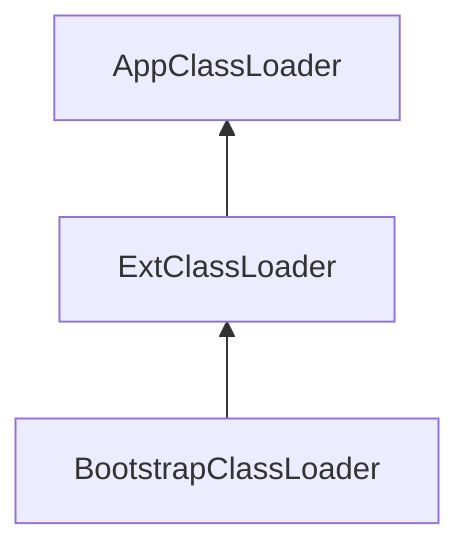
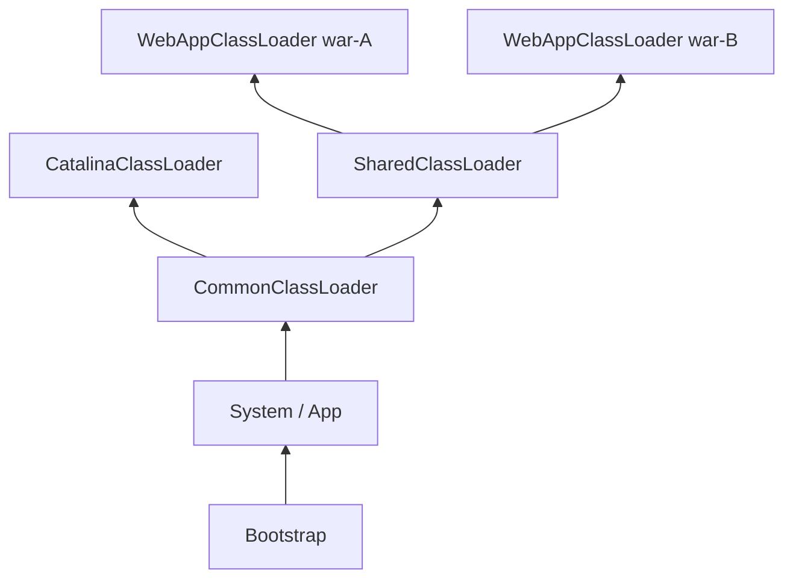

> **Tomcat 系列 · 第 3/4 篇**  
> 上一篇：[《Tomcat 线程模型与性能调优》](/性能调优/tomcat/tomcat-02-thread-tuning)  
> 下一篇：[《Tomcat 专题总结与拓展》](/性能调优/tomcat/tomcat-04-summary)

---

## 开头：容器里的类加载问题

Tomcat 既要加载 **Servlet 与依赖 JAR**，也要加载 **Tomcat 自身**；还要在同一 JVM 里跑 **多个 Web 应用**，可能同名不同实现的类、可能共享 Spring 等第三方库。

这与 [JVM 类加载机制](/性能调优/jvm/jvm-02-classloader) 直接相关，但 Tomcat **刻意打破双亲委派** 的一部分规则，并用 **多层 ClassLoader** 做隔离与共享。理解这套设计，才能解释热加载、Metaspace OOM 与「改 class 要不要重启」。

---

## 一、JVM 类加载器回顾

| 加载器 | 加载范围 |
|--------|----------|
| **Bootstrap** | `JRE/lib` 核心库（`rt.jar` 等） |
| **Extension** | `JRE/lib/ext` |
| **Application（App）** | `CLASSPATH` 下应用类 |
| **自定义** | 用户指定路径 |

验证层级：

```java
public class ClassLoaderDemo {
    public static void main(String[] args) {
        System.out.println(ReentrantLock.class.getClassLoader());        // null → Bootstrap
        System.out.println(ClassLoaderDemo.class.getClassLoader());      // AppClassLoader
        System.out.println(ClassLoader.getSystemClassLoader().getParent()); // Ext
    }
}
```



### 1.1 双亲委派

加载类时：**先委托父加载器**；父找不到再自己 `findClass`。

`ClassLoader.loadClass` 逻辑概要：

1. `findLoadedClass` — 已加载则直接返回
2. 有 parent → `parent.loadClass`；无 parent → Bootstrap
3. 仍未找到 → 当前加载器 `findClass`

**目的：**

- **沙箱安全**：自写的 `java.lang.String` 不会覆盖核心 API
- **避免重复加载**：父已加载则子不再加载，保证类唯一性

---

## 二、Tomcat 如何打破双亲委派

**WebAppClassLoader** 策略：**先尝试 Web 应用本地加载，再委托父加载器**——与标准双亲「先父后子」相反，目的是 **优先加载 Web 应用自己的类**（如覆盖 classpath 的同名类、war 内版本）。

### 2.1 findClass

1. Web 应用目录（`WEB-INF/classes`、`WEB-INF/lib`）查找
2. 找不到 → 父加载器（AppClassLoader）
3. 仍无 → `ClassNotFoundException`

### 2.2 loadClass（六步，关键）

1. 本地 cache（`findLoadedClass0`）是否已加载
2. 系统类加载器 cache（`findLoadedClass`）
3. **ExtClassLoader 加载**（防 Web 应用覆盖 JRE 核心类：若 Web 里有自定义 `Object`，Ext 委托 Bootstrap 发现已加载核心 `Object`，直接返回，不会用 Web 版覆盖）
4. 本地 `findClass`
5. **AppClassLoader**（`Class.forName(..., parent)`）
6. 全失败 → 异常

若第 3 步改成先 App 再 Ext，就退化成标准双亲委派；Tomcat 的「先 Ext 再本地再 App」是刻意设计。

---

## 三、Tomcat 类加载器层次与 Web 隔离

三个典型问题：

| 问题 | 需求 |
|------|------|
| 两个 war 同名 Servlet，实现不同 | **Web 应用间类隔离** |
| 两个 war 都依赖 Spring | **共享第三方 JAR，只加载一次** |
| Tomcat 自身类 vs Web 类 | **容器与应用隔离** |

Tomcat 的层次结构（自顶向下）：



| 加载器 | 可见性 |
|--------|--------|
| **CommonClassLoader** | Tomcat 与所有 Webapp 可访问的公共路径 |
| **CatalinaClassLoader** | 仅 Tomcat 容器私有，Webapp 不可见 |
| **SharedClassLoader** | 各 Webapp **共享**（如放 Spring JAR），Tomcat 容器不可见 |
| **WebAppClassLoader** | **仅当前 Web 应用**；每个 Context 一个实例，同名类在不同实例中视为不同类 |

- **隔离**：每个 Context 维护独立 **WebAppClassLoader** → 同名类不冲突。
- **共享**：WebApp 委托 **SharedClassLoader** 加载公共库，避免重复占 Metaspace。
- **容器私有**：**CatalinaClassLoader** 与 Web 侧 **兄弟关系**（同父 Common），相互隔离；Common 作为共同父加载器供 Catalina 与 Shared 复用。

配置路径见 `conf/catalina.properties` 中 `common.loader`、`server.loader`、`shared.loader`。

---

## 四、Spring 与线程上下文类加载器

**全盘负责**：ClassLoader 加载某类时，其依赖类默认也由**同一加载器**加载。

Spring 用 `Class.forName` 加载业务 Bean；`forName` 默认用**调用者的 ClassLoader**（Spring 在 Shared 路径则 Shared 加载业务类，但业务类在 `WEB-INF`，Shared 找不到）。

**线程上下文类加载器（TCCL）**：保存在 `Thread` 私有数据；Tomcat 启动 Web 应用线程时 **setContextClassLoader(WebAppClassLoader)**。Spring 启动时：

```java
ClassLoader cl = Thread.currentThread().getContextClassLoader();
```

用 TCCL 加载 Bean——与 [JVM 篇 SPI + TCCL](/性能调优/jvm/jvm-02-classloader) 同一套路。JDBC 驱动加载也是经典场景。

---

## 五、热加载与热部署

开发中常改 Java/JSP，希望少重启。Tomcat 提供两种机制：

| 机制 | 配置 | 执行主体 | Session | 典型环境 |
|------|------|----------|---------|----------|
| **热加载** | Context `reloadable="true"` | Context | **保留** | 开发 |
| **热部署** | Host `autoDeploy="true"` | Host | **清空** | 生产发布 |

```xml
<!-- 热加载：监视 WEB-INF/classes 与 lib 下 class -->
<Context docBase="/path/to/app" path="/mvc" reloadable="true" />

<!-- 热部署：监视 webapps 目录 WAR/目录变化 -->
<Host name="localhost" appBase="webapps"
      unpackWARs="true" autoDeploy="true">
```

**热加载**：后台线程检测 class 变更 → 重新加载类，**不清 Session**。  
**热部署**：检测 Web 应用目录/WAR 变化 → **整应用重新部署**，Context 销毁重建，**Session 清空**，更彻底。

---

## 六、后台线程与实现原理

### 6.1 ContainerBackgroundProcessor

Tomcat 9 用 **ScheduledThreadPoolExecutor** 跑 **ContainerBase.ContainerBackgroundProcessor**，周期性调用各容器 `backgroundProcess()`（含子容器递归）——子组件不必各自起线程，设计统一。

可借鉴：监控探针、健康检查等周期性任务。

### 6.2 热加载：Context + WebappLoader

`StandardContext.backgroundProcess()`：

```java
Loader loader = getLoader();
if (loader != null) {
    loader.backgroundProcess();  // WebappLoader 检查 WEB-INF
}
```

检测到变更 → **`Context.reload()`**：

1. stop 并销毁 Context 及 Wrapper（Servlet 实例销毁）
2. 销毁 Listener、Filter
3. 销毁 Pipeline、Valve
4. **销毁 WebAppClassLoader 及其加载的所有类**
5. start Context，**新建 ClassLoader** 加载新 class

类加载器销毁 = Metaspace 中该加载器加载的类可被回收（若无泄漏）。

### 6.3 热部署：HostConfig

Host 不在 `backgroundProcess` 里做检测，由监听器 **HostConfig** 响应 `Lifecycle.PERIODIC_EVENT` → `check()`：

- `autoDeploy` 时扫描 `webapps`
- 目录被删 → 销毁对应 Context
- 新 WAR/目录 → `deployApps()` 部署
- 检查的是 **应用目录级别**，不是单个 class 文件

---

## 本章小结

| 主题 | 要点 |
|------|------|
| 打破委派 | WebApp 优先本地；Ext 优先防覆盖 JRE 核心类 |
| 隔离 | 每 Context 一个 WebAppClassLoader |
| 共享 | SharedClassLoader + TCCL 给 Spring/JDBC |
| 热加载 | reloadable + WebappLoader → Context.reload |
| 热部署 | autoDeploy + HostConfig，宏观 redeploy |

生产环境慎用 `reloadable="true"`（频繁 reload 易 Metaspace/GC 压力）；发布用 **热部署** 或外部滚动发布更稳妥。

下一篇做 **Tomcat 专题总结**：设计模式串讲、调优检查清单，并串联 JVM 与 MySQL 专栏。
