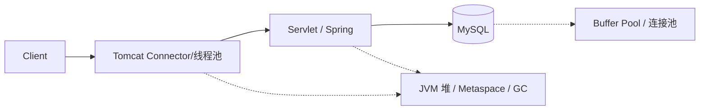

> **Tomcat 系列 · 第 4/4 篇**  
> 上一篇：[《Tomcat 类加载机制与热部署热加载》](/性能调优/tomcat/tomcat-03-classloader-hotdeploy)

---

## 开头：从组件到调优清单

前 3 篇分别讲了 **Connector/Container 架构**、**I/O 与线程池**、**类加载与热部署**。本篇做系列收束：用一张图回顾设计思路，对比 Tomcat 线程池与 JDK 线程池，给出 **线上排查与调优检查清单**，并说明 Tomcat 在更大性能体系里与 **JVM**、**MySQL** 如何配合。

---

## 一、Tomcat 整体架构回顾

**一句话**：对外 **Connector**（EndPoint → Processor → Adapter），对内 **Container 树**（Engine → Host → Context → Wrapper），请求经 **Mapper** 定位 Servlet，经 **Pipeline-Valve** 责任链进入 Filter 与 Servlet。

| 篇目 | 核心 takeaway |
|------|----------------|
| [01 架构](/性能调优/tomcat/tomcat-01-architecture) | 高内聚低耦合拆 EndPoint/Processor/Adapter；组合模式管容器；LifeCycle 一键启停 |
| [02 线程](/性能调优/tomcat/tomcat-02-thread-tuning) | 默认 NIO + 主从 Reactor；`maxThreads` 压测定；JMX 看 GlobalRequestProcessor |
| [03 类加载](/性能调优/tomcat/tomcat-03-classloader-hotdeploy) | WebAppClassLoader 打破委派；Shared 共享库；热加载 reload Context，热部署 redeploy Host |

---

## 二、设计模式速查

Tomcat 源码是 Java 服务端设计的「标本库」。面试或读源码时可按模式索引：

| 模式 | Tomcat 中的体现 |
|------|-----------------|
| **适配器** | CoyoteAdapter：Tomcat Request ↔ ServletRequest |
| **组合** | Container 树；Server.start 递归启动子组件 |
| **责任链** | Pipeline-Valve（对比 Servlet Filter 链） |
| **模板方法** | LifeCycleBase：init/start/stop 骨架 + `*Internal` 子类实现 |
| **观察者** | LifecycleListener；HostConfig 监听 PERIODIC_EVENT |
| **生产者-消费者** | Acceptor → Poller 队列 → Executor |

**Valve vs Filter**（再强调）：Valve 容器级、Tomcat 私有；Filter 应用级、Servlet 标准。Wrapper 链尾 Valve 才桥接到 FilterChain。

---

## 三、Tomcat 线程池 vs JDK 线程池

| 对比 | Tomcat Executor / 协议层线程池 | `java.util.concurrent.ThreadPoolExecutor` |
|------|--------------------------------|---------------------------------------------|
| **用途** | 处理 SocketProcessor / HTTP 解析与容器调用 | 通用异步任务 |
| **参数名** | `maxThreads`、`minSpareThreads`、`maxIdleTime` | `maximumPoolSize`、`corePoolSize`、`keepAliveTime` |
| **队列** | 与 Connector 接收、LimitLatch 配合；可配 `maxQueueSize` | 多种 BlockingQueue 策略 |
| **预启动** | `prestartminSpareThreads` 启动时建核心线程 | `prestartAllCoreThreads` |
| **绑定** | 与 Coyote Endpoint、ProtocolHandler 生命周期一体 | 业务代码自行管理 |

**调优时不要混概念**：改 `server.tomcat.threads.max` 影响的是 **Tomcat 工作线程**，不是业务里 `@Async` 的线程池。两者争抢同一批 CPU 核，压测时要一起看 [JVM CPU 与 GC](/性能调优/jvm/jvm-09-tuning-tools)。

---

## 四、与 JVM、MySQL 的衔接

Tomcat 只是链路中的一环。典型 Web 请求路径：

| 层级 | 专栏入口 | 与 Tomcat 的交界 |
|------|----------|------------------|
| **JVM** | [全面理解 JVM 虚拟机](/性能调优/jvm/jvm-01-overview) | 堆与 Metaspace 配置、Full GC 导致 RT 飙升；类加载与 [jvm-02 类加载](/性能调优/jvm/jvm-02-classloader) 对照 Tomcat WebAppClassLoader |
| **MySQL** | [全面理解 MySQL 架构](/数据库/mysql/mysql-01-architecture) | JDBC 连接池、慢 SQL；Tomcat 线程阻塞在 DB I/O 时，应增大线程数无效，需查 [Explain 与索引](/数据库/mysql/mysql-03-explain) |

**经验法则**：Tomcat `maxThreads` 调大仍慢 → 先看线程栈是否在等 DB、外部 HTTP、锁；再看 JVM GC 日志；最后才怀疑 Connector I/O 模型。

---

## 五、线上检查清单

### 5.1 架构与配置

- [ ] `server.xml` 中 Connector 协议是否为预期（生产 Linux 默认 `Http11NioProtocol`）
- [ ] 是否 unnecessary 开启 `reloadable="true"`（生产建议关）
- [ ] `URIEncoding="UTF-8"` 避免 GET 中文乱码
- [ ] 共享 Executor 是否复用在多个 Connector（避免重复建池）
- [ ] `connectionTimeout`、`maxConnections` / LimitLatch 是否与网关、LB 超时一致

### 5.2 线程与 I/O

- [ ] `maxThreads` / `minSpareThreads` 经压测验证，非盲目 200 或 2000
- [ ] JMX 或 APM 查看 `requestCount`、`processingTime`、`errorCount` 趋势
- [ ] 线程 dump：大量 BLOCKED 在 DB、Redis、锁 → 修业务而非只加线程
- [ ] TLS 高 QPS 评估 APR；Windows 大 body 可试 NIO2

### 5.3 JVM（配合 [JVM 调优工具](/性能调优/jvm/jvm-09-tuning-tools)）

- [ ] `-Xms` 与 `-Xmx` 对齐，减少堆扩容
- [ ] Metaspace 足够；频繁热加载/多 war 版本冲突时监控类卸载
- [ ] GC 日志或 JFR：Full GC 与 Tomcat RT 尖刺是否同步
- [ ] 禁止生产 `System.gc()` 触发 STW

### 5.4 类加载与部署

- [ ] 同一 JVM 多 war：Shared 目录放公共大 JAR，减少 Metaspace 重复
- [ ] 发布用滚动/蓝绿，而非依赖 `autoDeploy` 清 Session（除非可接受）
- [ ] 排查 ClassLoader 泄漏（热部署后 Metaspace 只涨不降）

### 5.5 全链路

- [ ] DB 连接池大小与 `maxThreads` 匹配（线程数 ≫ 连接数 → 等连接；连接数 ≫ 线程 → 浪费）
- [ ] 慢查询与 [MySQL 索引](/数据库/mysql/mysql-02-index-structure) 优化
- [ ] 静态资源是否应剥离到 CDN/Nginx，减轻 Tomcat 线程占用

---

## 六、拓展方向（选读）

| 方向 | 说明 |
|------|------|
| **Spring Boot 内嵌 Tomcat** | `WebServerFactoryCustomizer`、`TomcatServletWebServerFactory` 改端口、协议、线程（见 [02 篇](/性能调优/tomcat/tomcat-02-thread-tuning)） |
| **Undertow 对比** | 同为 Servlet 容器，线程模型与内存 footprint 不同；Boot 可 `spring.main.web-application-type` + 换容器依赖 |
| **反向代理** | Nginx → Tomcat 时，注意 keep-alive、缓冲、`X-Forwarded-*` 与真实 IP |
| **安全** | 收敛 `manager`/`host-manager`；TLS 终结在网关或 Tomcat |

---

## 系列总结

| # | 文章 | 一句话 |
|---|------|--------|
| 1 | [Tomcat 架构](/性能调优/tomcat/tomcat-01-architecture) | Connector + Container + 四种设计模式 |
| 2 | [线程与调优](/性能调优/tomcat/tomcat-02-thread-tuning) | NIO/Reactor + maxThreads + JMX |
| 3 | [类加载与热部署](/性能调优/tomcat/tomcat-03-classloader-hotdeploy) | WebAppClassLoader + reload vs redeploy |
| 4 | 本文 | 清单 + JVM/MySQL 串联 |

性能调优专栏至此：**JVM 12 篇**打底运行时，**Tomcat 4 篇**覆盖 Java Web 容器；数据层请继续 [MySQL 架构](/数据库/mysql/mysql-01-architecture) 系列。三块拼起来，才是一条请求从浏览器到磁盘再返回的完整视图。
