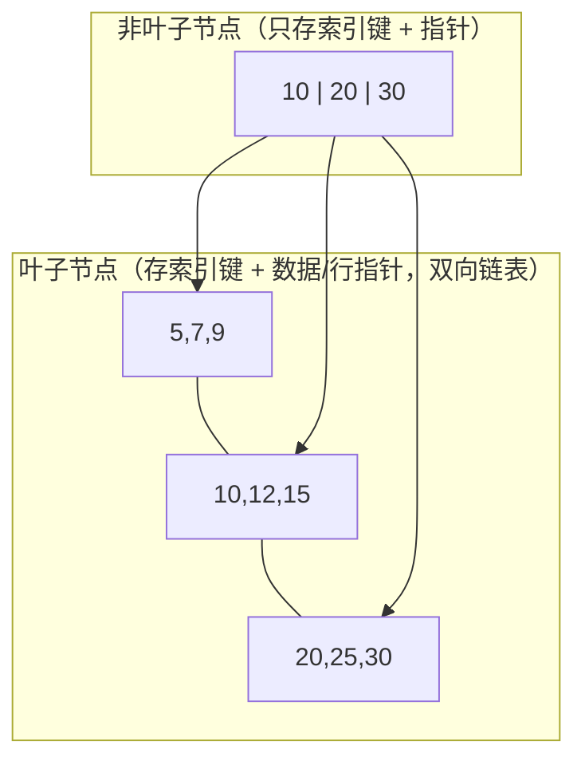

> **MySQL 系列 · 第 2/10 篇**  
> 上一篇：[《全面理解 MySQL 架构》](/数据库/mysql/mysql-01-architecture)  
> 下一篇：[《Explain 详解与索引最佳实践》](/数据库/mysql/mysql-03-explain)

---

## 开头：索引解决的核心问题

没有索引时，查找 `WHERE id = 10` 只能 **全表扫描**——从第一行扫到最后一行，时间复杂度 O(n)。数据量到百万、千万级，这种扫描不可接受。

**索引** 是一种以空间换时间的结构：按某种规则组织列值，让查找、排序、范围查询更快。InnoDB 默认使用 **B+ 树索引**。本篇讲清楚：为什么不是 Hash、为什么不是普通 B 树，以及聚簇索引与联合索引在磁盘上长什么样。

---

## 一、常见索引数据结构对比

### 1.1 Hash 索引

Hash 将 key 通过哈希函数映射到桶（bucket），等值查询平均 O(1)。

**优点**：点查极快。  
**缺点**：

- 不支持 **范围查询**、**排序**（`>`, `<`, `ORDER BY`）。
- 哈希冲突需要链表或开放寻址处理。
- 无法利用 **最左前缀** 做联合索引匹配。

Memory 引擎支持 Hash 索引；InnoDB 有 **自适应 Hash 索引**（内部优化，不可手动创建），但主索引结构仍是 B+ 树。

### 1.2 B 树（B-Tree）

B 树是多路平衡搜索树：每个节点存 **key + 数据**，非叶子节点也存数据。

- 树高低，磁盘 IO 次数少。
- 但 **非叶子节点占空间**，单页能存的 key 更少，同样数据量下树可能更高。

### 1.3 B+ 树（B+Tree）—— InnoDB 的选择

B+ 树在 B 树基础上做了关键改动：



| 特性 | B+ 树 |
|------|-------|
| 非叶子节点 | **只存索引键**，不存行数据 → 单页 key 更多，树更矮 |
| 叶子节点 | 存全部 key + 数据（或主键指针），**双向链表** 串联 |
| 范围查询 | 定位起点后沿叶子链表扫描，效率稳定 |
| 全表扫描 | 只需遍历叶子层链表 |

**InnoDB 选 B+ 树的原因**：磁盘 IO 按 **页**（默认 16KB）为单位；树越矮，随机 IO 越少；叶子链表天然支持范围扫描与排序。

---

## 二、InnoDB 中的两种索引

### 2.1 聚簇索引（Clustered Index）

InnoDB 表数据 **按主键顺序** 存放在 B+ 树的叶子节点——索引即数据，数据即索引。

- 必须有主键；未指定时 InnoDB 会选第一个非空 UNIQUE 或隐式生成 row_id。
- 一张表 **只有一个** 聚簇索引。
- 叶子节点存 **完整行记录**。

```sql
CREATE TABLE user (
  id   INT PRIMARY KEY,
  name VARCHAR(50),
  age  INT
);
-- 主键 id 的 B+ 树叶子节点即整行数据
```

### 2.2 二级索引（Secondary Index）

非主键索引的叶子节点存 **索引列值 + 对应主键值**，不存完整行。查非索引列需 **回表**：二级索引找到主键 → 再到聚簇索引取整行。

```sql
CREATE INDEX idx_name ON user(name);
-- 叶子：(name值, id) → 再用 id 查聚簇索引
```

**覆盖索引**：查询列全部在二级索引中，无需回表（后续 Explain 篇详述）。

### 2.3 页与 B+ 树节点

InnoDB 以 **页** 为最小 IO 单位（`innodb_page_size`，默认 16KB）。B+ 树一个节点通常对应一页；非叶子页存 `(key, 子页指针)`，叶子页存 `(key, 行或主键)`。

估算：INT 主键 + 指针，一页可存数千索引项，三层 B+ 树可支撑 **千万级** 行的高效点查。

---

## 三、联合索引与最左前缀

联合索引 `(name, age, position)` 在 B+ 树上按 **name → age → position** 排序存储。

```sql
CREATE TABLE employees (
  id       INT NOT NULL AUTO_INCREMENT,
  name     VARCHAR(24) NOT NULL DEFAULT '',
  age      INT NOT NULL DEFAULT 0,
  position VARCHAR(20) NOT NULL DEFAULT '',
  hire_time TIMESTAMP NOT NULL DEFAULT CURRENT_TIMESTAMP,
  PRIMARY KEY (id),
  KEY idx_name_age_position (name, age, position)
) ENGINE=InnoDB;

INSERT INTO employees(name, age, position, hire_time)
VALUES ('LiLei', 22, 'manager', NOW()),
       ('HanMeimei', 23, 'dev', NOW()),
       ('Lucy', 23, 'dev', NOW());
```

**最左前缀法则**：查询从索引 **最左列** 开始且 **不跳过中间列**，才能用好 B+ 树有序性。

```sql
-- ✅ 用到 name
EXPLAIN SELECT * FROM employees WHERE name = 'Bill' AND age = 31;

-- ❌ 未从最左列 name 开始，通常无法用该联合索引
EXPLAIN SELECT * FROM employees WHERE age = 30 AND position = 'dev';
EXPLAIN SELECT * FROM employees WHERE position = 'manager';
```

理解方式：B+ 树先按 name 排序；同一 name 内再按 age；再按 position。没有 name 条件，无法在树上做有序定位。

---

## 四、MySQL 8.0 索引跳跃扫描（Index Skip Scan）

MySQL 8.0 之前，「必须最左前缀」是铁律。 **8.0.13+** 引入 **Index Skip Scan**：在特定条件下，优化器可「跳过」联合索引 leading 列，仍使用该索引。

官方示例表：

```sql
CREATE TABLE t1 (f1 INT NOT NULL, f2 INT NOT NULL, PRIMARY KEY(f1, f2));
INSERT INTO t1 VALUES
(1,1),(1,2),(1,3),(1,4),(1,5),
(2,1),(2,2),(2,3),(2,4),(2,5);
INSERT INTO t1 SELECT f1, f2 + 5 FROM t1;
INSERT INTO t1 SELECT f1, f2 + 10 FROM t1;
INSERT INTO t1 SELECT f1, f2 + 20 FROM t1;
INSERT INTO t1 SELECT f1, f2 + 40 FROM t1;
ANALYZE TABLE t1;

EXPLAIN SELECT f1, f2 FROM t1 WHERE f2 > 40;
```

Extra 可能出现 **`Using index for skip scan`**：


**优化器等价思路**（概念上）：

```sql
SELECT f1, f2 FROM t1 WHERE f1 = 1 AND f2 > 40
UNION
SELECT f1, f2 FROM t1 WHERE f1 = 2 AND f2 > 40;
-- … 对每个 f1  distinct 值构造范围查询
```

**适用条件**（需同时满足）：

1. 单表查询，无 JOIN。
2. 无 `GROUP BY` / `DISTINCT`（部分版本有扩展，以官方文档为准）。
3. 查询列属于该索引。
4. leading 列 **基数低**（distinct 值少），拆成多次范围扫描仍比全表扫描划算。

**实践建议**：不能依赖该优化。建索引时仍应把 **区分度高、查询频繁** 的列放在联合索引 **左侧**。

---

## 五、索引类型速查

| 类型 | 说明 |
|------|------|
| PRIMARY KEY | 聚簇索引，唯一非空 |
| UNIQUE | 唯一索引，允许 NULL（NULL 不参与唯一约束比较的方式见版本文档） |
| INDEX / KEY | 普通二级索引 |
| FULLTEXT | 全文索引（InnoDB 5.6+） |
| SPATIAL | 空间索引 |

```sql
-- 前缀索引：长字符串只索引前 N 个字符
CREATE INDEX idx_title ON article(title(20));
```

---

## 小结

1. **B+ 树** 非叶子不存数据、叶子链表串联，适合磁盘页式存储与范围查询。
2. **聚簇索引** 叶子即数据；**二级索引** 叶子存主键，可能回表。
3. **联合索引** 遵循 **最左前缀**；MySQL 8.0 **Skip Scan** 是例外优化，不可作为设计依据。
4. 索引设计下一篇用 **Explain** 验证是否「真的用上了索引」。

---

**系列导航**

- 上一篇：[全面理解 MySQL 架构](/数据库/mysql/mysql-01-architecture)
- 下一篇：[Explain 详解与索引最佳实践](/数据库/mysql/mysql-03-explain)
